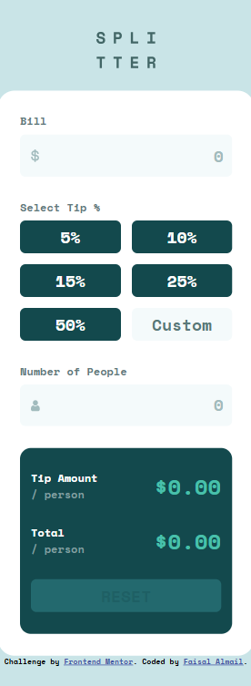
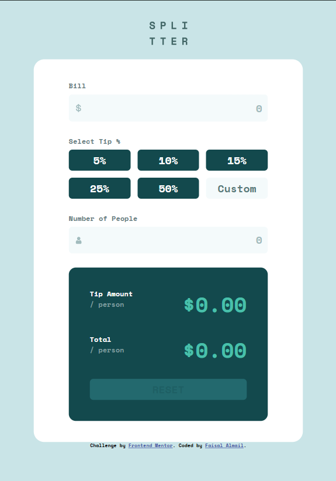
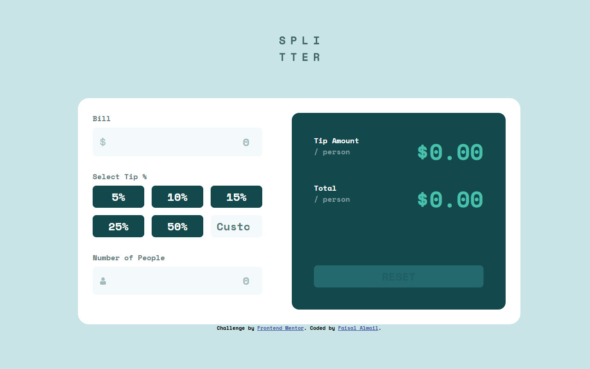

# Frontend Mentor - Tip calculator app solution

This is a solution to the [Tip calculator app challenge on Frontend Mentor](https://www.frontendmentor.io/challenges/tip-calculator-app-ugJNGbJUX). Frontend Mentor challenges help you improve your coding skills by building realistic projects.

## Table of contents

- [Overview](#overview)
  - [The challenge](#the-challenge)
  - [Screenshot](#screenshot)
  - [Links](#links)
- [My process](#my-process)
  - [Built with](#built-with)
  - [What I learned](#what-i-learned)
  - [Continued development](#continued-development)
  - [Useful resources](#useful-resources)
- [Author](#author)

**Note: Delete this note and update the table of contents based on what sections you keep.**

## Overview

### The challenge

Users should be able to:

- View the optimal layout for the app depending on their device's screen size
- See hover states for all interactive elements on the page
- Calculate the correct tip and total cost of the bill per person

### Screenshot

### Links

- Solution URL: [Add solution URL here](https://your-solution-url.com)
- Live Site URL: [Add live site URL here](https://your-live-site-url.com)

## My process

### Built with

- Semantic HTML5 markup
- CSS custom properties
- Flexbox
- CSS Grid
- Mobile-first workflow

### What I learned

I can say that the biggest thing I learned is the amount of work, logic and code involved in even a small simple tool like this one is not little.

I spent a good amount of time writing code for the functionality of the componets and still I think I can spend more time to make imporvements.

*I previously had a rule* I dont use ready code, I write my own. or simply put *code that I cant read, is code that I dont use*, and I think this rule is about to change for two reasons, *one* is that why reinvent the wheel if someone has already written the code that does something that I want to achieve, and *two* I can say now that I am learning to read and understand code.

### Continued development

I still have a lot to learn about JavaScript but I sure intend to dive into backend and fullstack.

### Useful resources

- [CSS grid generator](https://cssgrid-generator.netlify.app/) 

## Author

My name is Faisal - A 35 year old guy from a small island in the middle of the world called Bahrain. I had the passion to code and practiced with html and PHP long ago. I stopped then, but the passion never died. and this could be my way to return.

- Instagram - [Faisal Almail](https://www.instagram.com/faisal.almail)
- Frontend Mentor - [@FaisalAlmail](https://www.frontendmentor.io/profile/faisalalmail)
